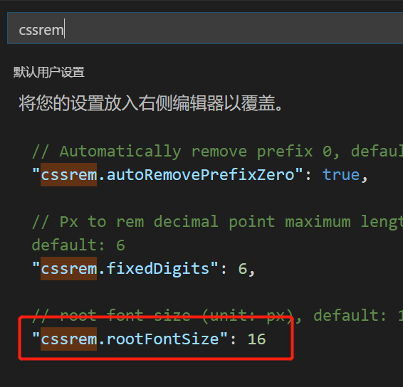

# 移动web开发之rem布局

### rem基础

#### 其他单位

+ cm(厘米),mm(毫米),m(米)

+ px(像素)
+ em(相对单位) 相对本身元素的font-size 如果本身没有font-size继承父元素
+ vw&vh
  + vw : 1vw 等于视口宽度的1% 换句话说就是vw的最大值是100 就是**手机宽度屏幕大小**
  + vh : 1vh 等于视口高度的1% 换句话说就是vh的最大值是100 就是**手机宽度屏幕大小**
  + vmin : 选取 vw 和 vh 中最小的那个
  + vmax : 选取 vw 和 vh 中最大的那个

#### rem单位

rem (root em)是一个相对单位，类似于em，em是本元素字体大小。

不同的是rem的基准是相对于html元素的字体大小。

比如，根元素（html）设置font-size=12px; 非根元素设置width:2rem; 则换成px表示就是24px。

```
/* 根html 为 12px */
html {
   font-size: 12px;
}
/* 此时 div 的字体大小就是 24px */       
div {
    font-size: 2rem;
}
```

rem的优势：父元素文字大小可能不一致， 但是整个页面只有一个html，可以很好来控制整个页面的元素大小。

### 媒体查询

#### 什么是媒体查询

媒体查询（Media Query）是CSS3新语法。

+ 使用 @media查询，可以针对不同的媒体类型定义不同的样式
+ @media 可以针对不同的屏幕尺寸设置不同的样式
+ 当你**重置resize**浏览器大小的过程中，页面也会根据浏览器的宽度和高度重新渲染页面 
+ 目前针对很多苹果手机、Android手机，平板等设备都用得到多媒体查询

#### 媒体查询语法规范

+ 用 @media开头 注意@符号
+ mediatype  媒体类型
+ 关键字 and  not  only
+ media feature 媒体特性必须有小括号包含

```
@media media_type and|not|only (media feature) {
    CSS-Code;
}
```

1. media type 查询类型

​       将不同的终端设备划分成不同的类型，称为媒体类型

|     值     |                                      |
| :--------: | :----------------------------------: |
|    all     |             用于所有设备             |
|   print    |         用于打印机和打印预览         |
| ==screen== | ==用于电脑屏幕,平板电脑,智能手机等== |

2. 关键字

​       关键字将媒体类型或多个媒体特性连接到一起做为媒体查询的条件。

+ and：可以将多个媒体特性连接到一起，相当于“且”的意思。
+ not：排除某个媒体类型，相当于“非”的意思，可以省略。
+ only：指定某个特定的媒体类型，可以省略。    

3. 媒体特性

   每种媒体类型都具体各自不同的特性，根据不同媒体类型的媒体特性设置不同的展示风格。我们暂且了解三个。

   注意他们要加小括号包含

   

   

4. 媒体查询书写规则

   注意： 为了防止混乱，媒体查询我们要按照从小到大或者从大到小的顺序来写,但是我们最喜欢的还是从小到大来写，这样代码更简洁

   

   

   

### less 基础

#### 维护css弊端

CSS 是一门非程序式语言，没有变量、函数、SCOPE（作用域）等概念。

+ CSS 需要书写大量看似没有逻辑的代码，CSS 冗余度是比较高的。
+ 不方便维护及扩展，不利于复用。
+ CSS 没有很好的计算能力
+ 非前端开发工程师来讲，往往会因为缺少 CSS 编写经验而很难写出组织良好且易于维护的 CSS 代码项目。 

#### Less 介绍 

Less（LeanerStyle Sheets 的缩写）是一门 CSS扩展语言，也成为**CSS预处理器**,他的本质js。

做为 CSS的一种形式的扩展，它并没有减少CSS的功能，而是在现有的CSS语法上，为CSS加入程序式语言的特性。

它在CSS 的语法基础之上，引入了变量，Mixin（混入），运算以及函数等功能，大大简化了 CSS 的编写，并且降低了 CSS的维护成本，就像它的名称所说的那样，Less可以让我们用更少的代码做更多的事情。

Less中文网址：[http://](http://lesscss.cn/)[less](http://lesscss.cn/)[css.cn/](http://lesscss.cn/)

常见的CSS预处理器：**Sass、Less、Stylus**

一句话：Less是一门 CSS 预处理语言，它扩展了CSS的动态特性。

Less安装

①安装nodejs，可选择版本(8.0)，网址：<http://nodejs.cn/download/>

②检查是否安装成功，使用cmd命令（win10是window+r 打开运行输入cmd）  ---输入“node –v”查看版本即可

③基于nodejs在线安装Less，使用cmd命令“**npm install -g less**”即可

④检查是否安装成功，使用cmd命令“ lessc -v ”查看版本即可

Less 使用之变量

变量是指没有固定的值，可以改变的。因为我们CSS中的一些颜色和数值等经常使用。

```
@变量名:值;
```

+ 必须有@为前缀
+ 不能包含特殊字符
+ 不能以数字开头
+ 大小写敏感

```less
@color: pink;
@Color: blue; /* 这是两个变量 */
```

Less 编译 vocode Less 插件

**Easy LESS** 插件用来把less文件编译为css文件

安装完毕插件，重新加载下 vscode。

只要保存一下Less文件，会自动生成CSS文件。


Less 嵌套

```
// 将css改为less
#header .logo {
  width: 300px;
}

#header {
    .logo {
       width: 300px;
    }
}

```

如果遇见 （交集|伪类|伪元素选择器） ，利用&进行连接

```
a:hover{
    color:red;
}
a{
  &:hover{
      color:red;
  }
}
```

Less 运算

任何数字、颜色或者变量都可以参与运算。就是Less提供了加（+）、减（-）、乘（*）、除（/）算术运算。

```
/*Less 里面写*/
@witdh: 10px + 5;
div {
    border: @witdh solid red;
}
/*生成的css*/
div {
  border: 15px solid red;
}
/*Less 甚至还可以这样 */
width: (@width + 5) * 2;

```

+ 乘号（*）和除号（/）的写法  
+ 运算符中间左右有个空格隔开 1px + 5
+ 对于两个不同的单位的值之间的运算，运算结果的值取第一个值的单位 
+ 如果两个值之间只有一个值有单位，则运算结果就取该单位

### rem适配方案

1. 让一些不能等比自适应的元素，达到当设备尺寸发生改变的时候，等比例适配当前设备。

2. 使用媒体查询根据不同设备按比例设置html的字体大小，然后页面元素使用rem做尺寸单位，当html字体大小变化元素尺寸也会发生变化，从而达到等比缩放的适配。

技术方案：

1. rem+媒体查询

2. flexible.js+rem

总结： 

两种方案现在都存在。

方案2 更简单，现阶段大家无需了解里面的js代码。

#### rem实际开发适配方案

##### css rem

①假设设计稿是750px

②假设我们把整个屏幕划分为10等份（划分标准不一可以是20份也可以是10等份）

③每一份作为html字体大小，这里就是75px

④那么在375px设备的时候，字体大小为375 /10 就是  37.5px

⑤用我们页面元素的大小除以不同的 html字体大小会发现他们比例还是相同的

⑥比如我们以750为标准设计稿

⑦一个375 \* 375 像素的页面元素在 750屏幕下，  就是 375 / 37.5  转换为rem  是  10rem*10rem  比例是1比1

⑧320屏幕下，  html字体大小为32px   则 2rem=  64px  此时宽和高都是 64px  但是宽和高的比例还是 1比1

⑨但是已经能实现不同屏幕下  页面元素盒子等比例缩放的效果

总结：

①最后的公式：页面元素的rem值 =  页面元素值（px） /  （屏幕宽度  /  划分的份数）

②屏幕宽度/划分的份数就是 htmlfont-size 的大小

③或者：页面元素的rem值 =  页面元素值（px） /  html font-size 字体大小

##### 直接针对各个分辨率范围在html上设置font-size

```css
html {font-size: 20px;} /* 1rem 都是20px */
@media only screen and (min-width: 400px) {html {font-size: 21.33px !important;}}
@media only screen and (min-width: 414px) {html {font-size: 22.08px !important;}}
@media only screen and (min-width: 480px) {html {font-size: 25.6px !important;}}
```

该方案的缺点会比较明显，不同尺寸梯度变换的时候，显示的尺度落差比较大，过渡不平滑，而且显示比例不可控制，用户体验较差。其实你可以理解这个方案就是一个移动端的bootstrap解决方案

##### js计算font-size

```css
var iW = document.documentElement.clientWidth;
document.querySelector('html').style.fontSize = iW / 10 + 'px';
```

+ 假设我将页面分成10份
+ 标准屏幕的大小为375px 即设计稿的大小为375px (特别注意 这里的屏幕大小指的不是物理像素,而是开发像素) 
+ 那么font-size: 75px
+ 所以10rem = 75 * 10 = 750px
+ 跑了js代码

##### vw和vh等响应式单位

根据CSS3规范，视口单位主要包括以下4个

- vw : 1vw 等于视口宽度的1% 换句话说就是vw的最大值是100 就是**手机宽度屏幕大小**
- vh : 1vh 等于视口高度的1% 换句话说就是vh的最大值是100 就是**手机宽度屏幕大小**
- vmin : 选取 vw 和 vh 中最小的那个
- vmax : 选取 vw 和 vh 中最大的那个

vw和vh是完全匹配设备视口的单位 即:将手机端视口100等分,每一个单位表示的就是百分之1 那么该单位完全可以用来做响应式,且粒度更小

相对于上面的做法

+ 页面显示更加平滑 在320-540之间永远是平滑改变的
+ 不过缺点就是过于平滑了 导致超小屏幕 <320px 和 超大屏幕>540px 显示不够优化

```css
/* mobile.width = 750px  => 750px = 100% =100vw => 750px = 100vw => 1px = 0.1333vw => 100px = 13.33vw => 1rem =100px; 100/750=0.1333333*/
750px 等于 100% 又等于 100vw
1vw 等于 7.5px
1px 等于 1/7.5vw 也就是 0.1333vw
0.13vm表示1px
为了便于我们计算浏览器内容 我们将根元素font-size设置为100倍 手动得到换算公式
1rem = 100px 换言之就是body中的内容都可以通过rem来计算 width: .5rem 表示是该元素在设计稿的宽度是50px
html {
  font-size: 13.33333vw
}

@media screen and (max-width:320px) {
  html {
      font-size: 42.667px; /*320除以750=0.42667*/
  }
}

@media screen and (min-width:540px) {
  html {
      font-size: 72px;/*540除以750=0.72*/
  }
}
```

### rem 适配方案2

手机淘宝团队出的简洁高效 移动端适配库

我们再也不需要在写不同屏幕的媒体查询，因为里面js做了处理

它的原理是把当前设备划分为10等份，但是不同设备下，比例还是一致的。

我们要做的，就是确定好我们当前设备的html 文字大小就可以了

比如当前设计稿是 750px， 那么我们只需要把 html 文字大小设置为 75px(750px / 10) 就可以

里面页面元素rem值： 页面元素的px 值 /  75  

剩余的，让flexible.js来去算

github地址：[https://github.com/amfe/lib-flexible](https://link.jianshu.com/?t=https://github.com/amfe/lib-flexible)

总结：

**因为flexible是默认将屏幕分为10等分**

**但是当屏幕大于750的时候希望不要再去重置html字体了**

**所以要自己通过媒体查询设置一下**

**并且要把权重提到最高**

VSCode  px 转换rem 插件 cssrem 

因为cssrem中css自动转化为rem是参照默认插件的16转换的所以需要自己配置




