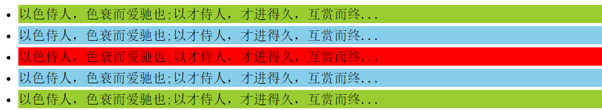
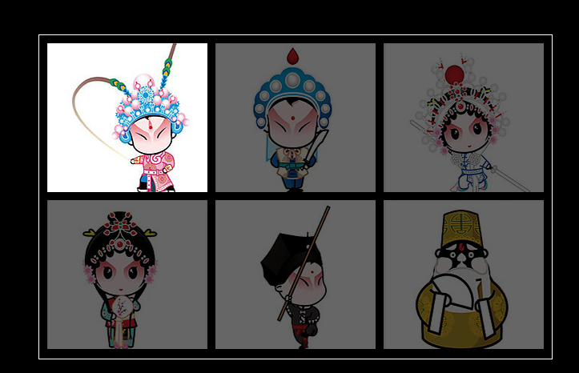
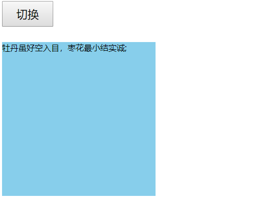

# 每日作业-jQuery第01天

### 1 - 隔行变色加高亮显示（加强训练）

- 题目描述

   仿股票等表单显示数据，各行变色，外加高亮显示，具体表现如下图：

   1）所有展示数据各行变色，颜色自定义。

   2）鼠标进入后高亮显示，移开后恢复。

- 训练目标

  学会使用 jQuery 的选择器，熟练样式操作 css()。

- 训练提示

  1.获取奇数行和偶数行

  2.设置不一样的颜色

  3.鼠标进入设置其他颜色

  4.移开恢复正常或者鼠标进入重新设置隔行变色覆盖之前操作

- 参考方案

  mouseover事件，或者 hover事件均可。

###    2 - 突出显示（加强训练）

- 题目描述

  突出显示案例，具体表现如下图：

  

- 训练目标

  能够使用 css()，设置样式

- 训练提示

  1.鼠标进入li，所有li，透明度设置为1，当前的为0.4

  2.移开后，所有li，透明度全部设置为1.

  3.mouseenter()、mouseleave()没有冒泡，也可以参考hover()

###    3 - 切换盒子背景色（综合练习）

- 题目描述

  以 css() 和 类操作两种形式操作改变盒子的背景色。

  

- 训练目标

  能够使用jQuery操作元素的样式属性

- 训练提示

  1.两种方法：css() 和 类操作样式

