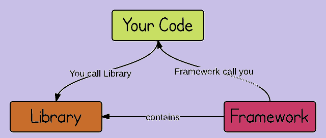
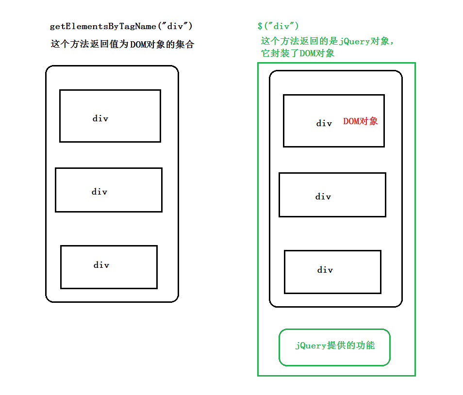
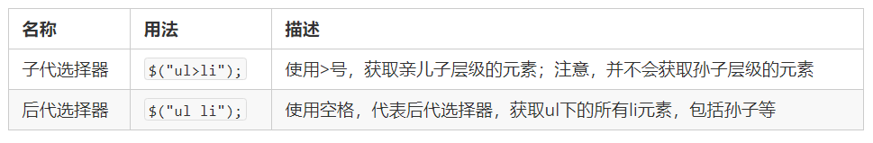
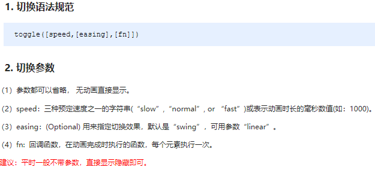
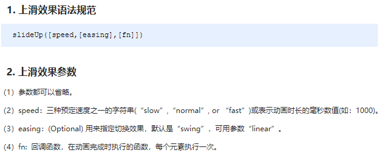

# day01 - jQuery


## 1.1. jQuery 介绍

### 1.1.1 JavaScript 库

​	JavaScript**库**：即 library，是一个**封装好的**特定的**集合**（方法和函数）。从封装一大堆函数的角度理解库，就是在这个库中，封装了很多预先定义好的函数在里面，比如动画animate、hide、show，比如获取元素等。(工具包)

> 简单理解： 就是一个JS 文件，jQ里面对我们原生js代码进行了封装，存放到里面。这样我们可以快速高效的使用这些封装好的功能了。
>
> 比如 jQuery，就是为了快速方便的**操作DOM**，里面基本都是函数（方法）。

​	常见的JavaScript 库：**jQuery**、Understore、Lodash、移动端的**zepto**等，这些库都是对原生 JavaScript 的封装，内部都是用 JavaScript 实现的，我们主要学习的是 jQuery。

**框架(vue/react/angular/小程序)**与**库**之间最本质区别在于控制权：you call libs, frameworks call you

库：库是更多是一个封装好的特定的集合，提供给开发者使用，而且是特定于某一方面的集合（方法和函数），库没有控制权，控制权在使用者手中，在库中查询需要的功能在自己的应用中使用，我们可以从封装的角度理解库；

框架：框架顾名思义就是一套架构，是一套解决方案,会基于自身的特点向用户提供一套相当于叫完整的解决方案，而且控制权的在框架本身，使用者要找框架所规定的某种规范进行开发。



### 1.1.2 jQuery的概念

​	jQuery总体概况如下 :

- jQuery 是一个快速、简洁的 JavaScript 库，其设计的宗旨是“write Less，Do More”，即倡导写更少的代码，做更多的事情。

- j 就是 JavaScript；   Query 查询； 意思就是查询js，把js中的DOM操作做了封装，我们可以快速的查询使用里面的功能。

- jQuery 封装了 JavaScript 常用的功能代码，优化了 DOM 操作、事件处理、动画设计和 Ajax 交互。

- 学习jQuery本质： 就是学习调用这些函数（方法）。

- jQuery 出现的目的是加快前端人员的页面开发速度，我们可以非常方便的调用和使用它，从而提高**开发效率**。 反而降低了**运行效率**

  

### 1.1.3 jQuery的优点

+ **轻量级**

jQuery非常轻巧，采用Dean Edwards编写的Packer压缩后，大小不到30KB,如果使用Min版并且在服务器端启用Gzip压缩后，大小只有18KB。

- **强大的选择器**

jQuery允许开发者使用从CSS1到CSS3几乎所有的选择器,以及jQuery独创的高级而且复杂的选择器.

注: 这点优势已经不在具备 因为出现两个方法 **querySelector** && **querySelectorAll**

- **出色的DOM操作的封装**

jQuery封装了大量常用的DOM操作，使开发者在编写DOM操作相关程序的时候能够得心应手。jQuery轻松地完成各种原本非常复杂的操作，让JavaScript新手也能写出出色的程序。

注: 优秀的DOM操作让jQuery屹立于DOM操作时代所有类库的巅峰,他击败了所有DOM操作类库.但是现在他的统治地位在几年前已经被打破并迅速跌落神坛.**MVVM**的操作模式更加现代化,更加解耦.更加数据和业务分离.这点是导致jQuery彻底没落的真正原因.正如击败统一方便面的并不是康师傅方便面.而是饿了么和美团的外卖

- **可靠的事件处理机制**

jQuery的事件处理机制吸收了JavaScript专家Dean Edwards编写的事件处理函数的精华，是的jQuery在处理事件绑定的时候相当可靠。在预留退路、循序渐进以及非入侵式编程思想方面，jQuery也做得非常不错。

注: 这点优势也不再具备 因为出现了一个方法 **addEventListener**

- **完善的Ajax**

jQuery将所有的Ajax操作封装到一个函数$.ajax()里，使得开发者处理Ajax的时候能够专心处理业务逻辑而无需关心复杂的浏览器兼容性和XMLHttpRequest对象的创建和使用的问题。

注: 这点优势亦不具备了.因为封装一个小型的ajax代码.插件的难度并不是很高.代码量也比较小.不过$.ajax这个方法还是非常实用的且能够兼容所有浏览器.只是如果仅仅只是为了ajax方法,那么我们没有必要单独使用jQuery插件

- **不污染顶级变量**

jQuery只建立一个名为JQuery的对象，其所有的函数方法都在这个对象之下。其别名$也可以随时交流控制权，绝对不会污染其他的对象。该特性是JQuery可以与其他JavaScript库共存，在项目中放心地引用而不需要考虑到后期的冲突。

注: 但凡是插件或者类库,都仅仅只有一个顶层对象,从来都不会污染作用域

- **出色的浏览器兼容性**

作为一个流行的JavaScript库，浏览器的兼容性是必须具备的条件之一。JQuery能够在IE6.0+,FF 2+,Safari2.+和Opera9.0+下正常运行。JQuery同时修复了一些浏览器之间的的差异，使开发者不必在开展项目前建立浏览器兼容库。

注: 这点非常赞.也正是很多人用jQuery理由.对!就是兼容性!能够兼容所有低版本的非标准浏览器包括IE6/7/8.不过很尴尬的点是2.x又抛弃了IE6/7/8,导致一些开发者为了兼容IE低版本浏览器又只能使用IE6/7/8.另一些开发者因为无法兼容又只能抛弃jQuery

- **链式操作方式**

jQuery中最有特色的莫过于它的链式操作方式——即对发生在同一个JQuery对象上的一组动作，可以直接接连写无需要重复获取对象。这一特点使得JQuery的代码无比优雅。

注: jQuery首创.独门秘籍.非常酷的优点.甚至有些现代框架和ES6仍然没有实现如此的实现方法.但是由于太链式了,有人又攻击会写成面条式代码

- **隐式迭代**

当用JQuery找到带有“.myClass”类的全部元素，然后隐藏他们时。无需循环遍历每一个返回的元素。相反，JQuery里的方法都被设计成自动操作的对象集合，而不是单独的对象，这使得大量的循环结构变得不再必要，从而大幅度地减少代码量。

注: jQuery的优点.能够尽量少的使用到循环.这点很赞.该思路现在还不过时

- **行为层与结构层的分离**

开发者可以使用选择器选中元素，然后直接给元素添加事件。这种将行为层与结构层完全分离的思想，可以使jQuery开发人员和HTML或其他页面开发人员各司其职，摆脱过去开发冲突或个人单干的开发模式。同时，后期维护也非常方便，不需要在HTML代码中寻找某些函数和重复修改HTML代码。

注: 完全是上一代的开发思路.现在讲究的是**数据层**和**业务层**的分离

- **丰富的插件支持**

jQuery的易扩展性，吸引了来自全球开发者来编写JQuery的扩展插件。目前已经有超过几百种官方插件支持，而且还不断有新插件面试。

注: 插件支持在同时代的插件的确非常非常多

- **完善的文档**

jQuery的文档非常丰富，现阶段多位英文文档，中文文档相对较少。很多热爱jQuery的团队都在努力完善jQuery中文文档，例如jQuery的中文API。

注: 相对完整

- **开源**

　jQuery是一个开源的产品，任何人都可以自由地使用并提出修改意见。

注: 好的产品注定是**开源**的.

## 1.2. jQuery 的基本使用

### 1.2.1 jQuery 的下载

​	jQuery的官网地址： https://jquery.com/，官网即可下载最新版本。

>  各个版本的下载：https://code.jquery.com/

​	版本介绍：

> 1x ：兼容 IE 678 等低版本浏览器， 官网不再更新
>
> 2x ：不兼容 IE 678 等低版本浏览器， 官网不再更新
>
> 3x ：不兼容 IE 678 等低版本浏览器， 是官方主要更新维护的版本

### 1.2.2. 体验jQuery

​	步骤：

- 引入jQuery文件。
- 在文档最末尾插入 script 标签，书写体验代码。
- $('div').hide() 可以隐藏盒子。

### 1.2.3. jQuery的入口函数

​	jQuery中常见的两种入口函数：

```javascript
// 第一种: 简单易用。
//在jQuery中 $就是jQuery jQuery就是$
//window.jQuery = window.$
$(function () {   
    ...  // 此处是页面 DOM 加载完成的入口
}) ; 

// 第二种: 繁琐，但是也可以实现
$(document).ready(function(){
   ...  //  此处是页面DOM加载完成的入口
});

//真load方法
$(window).load(function(){
  //编写代码
})
```

​	注意对比window.onload方法

总结：

1. 等着 DOM 结构渲染完毕即可执行内部代码，不必等到所有外部资源加载完成，jQuery 帮我们完成了封装。
2. 相当于原生 js 中的 DOMContentLoaded。
3. 不同于原生 js 中的 load 事件是等页面文档、外部的 js 文件、css文件、图片加载完毕才执行内部代码。
4. 更推荐使用第一种方式。

### 1.2.4. jQuery中的顶级对象$

1.  \$是 jQuery 的别称，在代码中可以使用 jQuery 代替，但一般为了方便，通常都直接使用 $ 。
2.  \$是jQuery的顶级对象，相当于原生JavaScript中的 window。把元素利用$包装成jQuery对象，就可以调用jQuery 的方法。
3.  （**控制反转 IoC：Inverse of Contorll**）
4.  关于控制反转，一句话总结：控制反转这里控制权从使用者本身转移到第三方容器上，而非是转移到被调用者上，这里需要明确不要疑惑。控制反转是一种思想，依赖注入是一种设计模式。

### 1.2.5.  jQuery 对象和 DOM 对象

**但是特别注意** 仅仅是选择的元素不一样.语法是可以混用的!

​	使用 jQuery 方法和原生JS获取的元素是不一样的，总结如下 : 

1. 用原生 JS 获取来的对象就是 DOM 对象
2. jQuery 方法获取的元素就是 jQuery 对象。
3. jQuery 对象本质是： 利用$对DOM 对象包装后产生的对象（伪数组形式存储）。

> 注意：
>
> 只有 jQuery 对象才能使用 jQuery 方法，DOM 对象则使用原生的 JavaScirpt 方法。



### 1.2.6.  jQuery 对象和 DOM 对象转换

​	DOM 对象与 jQuery 对象之间是可以相互转换的。因为原生js 比 jQuery 更大，原生的一些属性和方法 jQuery没有给我们封装. 要想使用这些属性和方法需要把jQuery对象转换为DOM对象才能使用。

```javascript
// 1.DOM对象转换成jQuery对象，方法只有一种
var box = document.getElementById('box');  // 获取DOM对象
var jQueryObject = $(box);  // 把DOM对象转换为 jQuery 对象

// 2.jQuery 对象转换为 DOM 对象有两种方法：
//   2.1 jQuery对象[索引值]
var domObject1 = $('div')[0]

//   2.2 jQuery对象.get(索引值)
var domObject2 = $('div').get(0)
 
```

总结：实际开发比较常用的是把DOM对象转换为jQuery对象，这样能够调用功能更加强大的jQuery中的方法。

## 1.3. jQuery 选择器 (兼容)

​	原生 JS 获取元素方式很多，很杂，而且兼容性情况不一致，因此 jQuery 给我们做了封装，使获取元素统一标准。

### 1.3.1. 基础选择器

```js
$("选择器")   //  里面选择器直接写 CSS 选择器即可，但是要加引号 
```

​	

### 1.3.2. 层级选择器

​	层级选择器最常用的两个分别为：后代选择器和子代选择器。

​	

**基础选择器和层级选择器案例代码**

```html
<body>
    <div>我是div</div>
    <div class="nav">我是nav div</div>
    <p>我是p</p>
    <ul>
        <li>我是ul 的</li>
        <li>我是ul 的</li>        
        <li>我是ul 的</li>
    </ul>
    <script>
        $(function() {
            console.log($(".nav"));
            console.log($("ul li"));
        })
    </script>
</body>
```

### 1.3.3. 筛选选择器

​	筛选选择器，顾名思义就是在所有的选项中选择满足条件的进行筛选选择。常见如下 :


**案例代码**

```html
<body>
    <ul>
        <li>多个里面筛选几个</li>
        <li>多个里面筛选几个</li>
        <li>多个里面筛选几个</li>
        <li>多个里面筛选几个</li>
        <li>多个里面筛选几个</li>
        <li>多个里面筛选几个</li>
    </ul>
    <ol>
        <li>多个里面筛选几个</li>
        <li>多个里面筛选几个</li>
        <li>多个里面筛选几个</li>
        <li>多个里面筛选几个</li>
        <li>多个里面筛选几个</li>
        <li>多个里面筛选几个</li>
    </ol>
    <script>
        $(function() {
            $("ul li:first").css("color", "red");
            $("ul li:eq(2)").css("color", "blue");
            $("ol li:odd").css("color", "skyblue");
            $("ol li:even").css("color", "pink");
        })
    </script>
</body>
```

另:  jQuery中还有一些筛选方法，类似DOM中的通过一个节点找另外一个节点，父、子、兄以外有所加强。


parent() children() find() siblings() eq()

偏重于记忆，演示代码略。

### 1.3.4 知识铺垫

- jQuery 设置样式

```javascript
$('div').css('属性', '值')    
```

- jQuery 里面的排他思想

```javascript
// 想要多选一的效果，排他思想：当前元素设置样式，其余的兄弟元素清除样式。
$(this).css(“color”,”red”);
$(this).siblings(). css(“color”,””);
```

- **隐式迭代** **非常重要**

```javascript
// 遍历内部 DOM 元素（伪数组形式存储）的过程就叫做隐式迭代。
// 简单理解：给匹配到的所有元素进行循环遍历，执行相应的方法，而不用我们再进行循环，简化我们的操作，方便我们调用。
$('div').hide();  // 页面中所有的div全部隐藏，不用循环操作
```

- **链式编程**  **非常重要**

```javascript
// 链式编程是为了节省代码量，看起来更优雅。
$(this).css('color', 'red').sibling().css('color', ''); 
```

### 1.3.5 案例：淘宝服饰精品案例
> 思路分析: 
> 1.核心原理：鼠标经过左侧盒子某个小li，就让内容区盒子相对应图片显示，其余的图片隐藏。
> 2.需要得到当前小li 的索引号，就可以显示对应索引号的图片
> 3.jQuery 得到当前元素索引号 $(this).index()
> 4.中间对应的图片，可以通过  eq(index) 方法去选择
> 5.显示元素 show()   隐藏元素 hide()

​	代码实现略。(详情参考源代码)

## 1.4.  jQuery 样式操作

​	jQuery中常用的样式操作有两种：css() 和 设置类样式方法

### 1.4.1. 方法1: 操作 css 方法

​	jQuery 可以使用 css 方法来修改简单元素样式； 也可以操作类，修改多个样式。

​	常用以下三种形式 : 

```javascript
// 1.参数只写属性名，则是返回属性值
var strColor = $(this).css('color');

// 2.  参数是属性名，属性值，逗号分隔，是设置一组样式，属性必须加引号，值如果是数字可以不用跟单位和引号
$(this).css(''color'', ''red'');

// 3.  参数可以是对象形式，方便设置多组样式。属性名和属性值用冒号隔开， 属性可以不用加引号
$(this).css({ "color":"white","font-size":"20px"});
//js中相似的方法有 setAttribute() 和 cssText = "" 但是都不如这种形式优秀

```

​	注意：css() 多用于样式少时操作，多了则不太方便。

### 1.4.2. 方法2: 设置类样式方法

​	作用等同于以前的 classList，可以操作类样式， 注意操作类里面的参数不要加点。

​	常用的三种设置类样式方法：

```javascript
// 1.添加类
$("div").addClass("current");
//完全等价于classList中的add函数

// 2.删除类
$("div").removeClass("current");
//完全等价于classList中的remove函数

// 3.切换类
$("div").toggleClass("current");
//完全等价于classList中的toggle函数

```

​	注意：

1. 设置类样式方法比较适合样式多时操作，可以弥补css()的不足。
2. 原生 JS 中 className 会覆盖元素原先里面的类名，jQuery 里面类操作只是对指定类进行操作，不影响原先的类名。

### 1.4.3. 案例：选项卡

## 1.5. jQuery 效果

​	jQuery 给我们封装了很多动画效果，最为常见的如下：

- 显示隐藏：show() / hide() / toggle() ;
- 划入画出：slideDown() / slideUp() / slideToggle() ; 
- 淡入淡出：fadeIn() / fadeOut() / fadeToggle() / fadeTo() ; 
- 自定义动画：animate() ;

> 注意：
>
> 动画或者效果一旦触发就会执行，如果多次触发，就造成多个动画或者效果排队执行。
>
> jQuery为我们提供另一个方法，可以停止动画排队：stop() ;

### 1.5.1. 显示隐藏

​	显示隐藏动画，常见有三个方法：show() / hide() / toggle() ;

​	语法规范如下:




**代码演示**

```javascript
<body>
    <button>显示</button>
    <button>隐藏</button>
    <button>切换</button>
    <div></div>
    <script>
        $(function() {
            $("button").eq(0).click(function() {
                $("div").show(1000, function() {
                    alert(1);
                });
            })
            $("button").eq(1).click(function() {
                $("div").hide(1000, function() {
                    alert(1);
                });
            })
            $("button").eq(2).click(function() {
              $("div").toggle(1000);
            })
            // 一般情况下，我们都不加参数直接显示隐藏就可以了
        });
    </script>
</body>
```

### 1.5.2. 滑入滑出

​	滑入滑出动画，常见有三个方法：slideDown() / slideUp() / slideToggle() ; 

​	语法规范如下:





**代码演示**

```javascript
<body>
    <button>下拉滑动</button>
    <button>上拉滑动</button>
    <button>切换滑动</button>
    <div></div>
    <script>
        $(function() {
            $("button").eq(0).click(function() {
                // 下滑动 slideDown()
                $("div").slideDown();
            })
            $("button").eq(1).click(function() {
                // 上滑动 slideUp()
                $("div").slideUp(500);
            })
            $("button").eq(2).click(function() {
                // 滑动切换 slideToggle()
                $("div").slideToggle(500);
            });
        });
    </script>
</body>
```

> 小案例：下拉菜单略（详情参看源码）。

### 1.5.3 淡入淡出

​	淡入淡出动画，常见有四个方法：fadeIn() / fadeOut() / fadeToggle() / fadeTo() ; 

​	语法规范如下:


**代码演示**

```javascript
<body>
    <button>淡入效果</button>
    <button>淡出效果</button>
    <button>淡入淡出切换</button>
    <button>修改透明度</button>
    <div></div>
    <script>
        $(function() {
            $("button").eq(0).click(function() {
                // 淡入 fadeIn()
                $("div").fadeIn(1000);
            })
            $("button").eq(1).click(function() {
                // 淡出 fadeOut()
                $("div").fadeOut(1000);
            })
            $("button").eq(2).click(function() {
                // 淡入淡出切换 fadeToggle()
                $("div").fadeToggle(1000);
            });
            $("button").eq(3).click(function() {
                //  修改透明度 fadeTo() 这个速度和透明度要必须写
                $("div").fadeTo(1000, 0.5);
            });
        });
    </script>
</body>
```

### 1.5.4 自定义动画

​	自定义动画非常强大，通过参数的传递可以模拟以上所有动画，方法为：animate() ;

​	语法规范如下:


**代码演示**

```javascript
<body>
    <button>动起来</button>
    <div></div>
    <script>
        $(function() {
            $("button").click(function() {
                $("div").animate({
                    left: 500,
                    top: 300,
                    opacity: .4,
                    width: 500
                }, 500);
            })
        })
    </script>
</body>
```

### 1.5.5 停止动画排队

​	动画或者效果一旦触发就会执行，如果多次触发，就造成多个动画或者效果排队执行。

​	停止动画排队的方法为：stop() ; 

- stop() 方法用于停止动画或效果。
- stop() 写到动画或者效果的前面， 相当于停止结束上一次的动画。

​        总结: 每次使用动画之前，先调用 stop() ,在调用动画。

### 1.5.6. 事件切换

​	jQuery中为我们添加了一个新事件 hover() ; 功能类似 css 中的伪类 :hover 。介绍如下

**语法**

```javascript
hover([over,]out)     // 其中over和out为两个函数
```

- over:鼠标移到元素上要触发的函数（相当于mouseenter）
- out:鼠标移出元素要触发的函数（相当于mouseleave）
- 如果只写一个函数，则鼠标经过和离开都会触发它

**hover事件和停止动画排列案例**

```javascript
<body>
    <ul class="nav">
        <li>
            <a href="#">微博</a>
            <ul><li><a href="">私信</a></li><li><a href="">评论</a></li><li><a href="">@我</a></li></ul>
        </li>
        <li>
            <a href="#">微博</a>
            <ul><li><a href="">私信</a></li><li><a href="">评论</a></li><li><a href="">@我</a></li></ul>
        </li>
    </ul>
    <script>
        $(function() {
            // 鼠标经过
            // $(".nav>li").mouseover(function() {
            //     // $(this) jQuery 当前元素  this不要加引号
            //     // show() 显示元素  hide() 隐藏元素
            //     $(this).children("ul").slideDown(200);
            // });
            // // 鼠标离开
            // $(".nav>li").mouseout(function() {
            //     $(this).children("ul").slideUp(200);
            // });
            // 1. 事件切换 hover 就是鼠标经过和离开的复合写法
            // $(".nav>li").hover(function() {
            //     $(this).children("ul").slideDown(200);
            // }, function() {
            //     $(this).children("ul").slideUp(200);
            // });
            // 2. 事件切换 hover  如果只写一个函数，那么鼠标经过和鼠标离开都会触发这个函数
            $(".nav>li").hover(function() {
                // stop 方法必须写到动画的前面
                $(this).children("ul").stop().slideToggle();
            });
        })
    </script>
</body>
```
